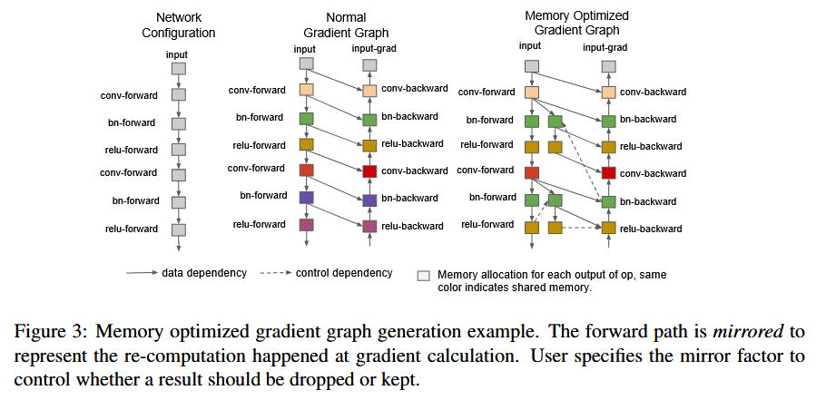

# GPipe: Easy Scaling with Micro-Batch Pipeline Parallelism

> Huang, Yanping, Youlong Cheng, Ankur Bapna, Orhan Firat, Mia Xu Chen, Dehao Chen, HyoukJoong Lee, 等. 《GPipe: Efficient Training of Giant Neural Networks Using Pipeline Parallelism》. arXiv, 2019年7月25日. http://arxiv.org/abs/1811.06965.

## 一、问题背景

“most efficient model-parallel algorithms are architecture and task-specific.”

GPipe之前的许多模型并行化算法通常依赖于特定任务和架构，因此难以转移到其他任务。

作者提出了 **GPipe**，一个可以高效扩展任意深度网络的流水线并行（Pipeline Parallelism）库。GPipe 允许在多个加速器上划分模型，使用微批次（micro-batch）方法实现近似线性加速，并通过两个实验（图像分类和多语言机器翻译）验证了其可扩展性和灵活性。

“With GPipe, each model can be specified as a sequence of layers, and consecutive groups of layers can be partitioned into cells. Each cell is then placed on a separate accelerator.”

具体来说，它将训练数据的小批量（mini-batch）划分为更小的微批量（micro-batch），并在多个加速器之间对这些微批量进行流水线处理。在训练过程中，GPipe采用**同步小批量梯度下降**（synchronous mini-batch gradient descent），即在每个小批量结束时，对所有微批量的梯度进行累积并进行更新。这种方法确保了无论分区数量如何，梯度更新始终一致，研究人员可以通过增加加速器数量来轻松训练越来越大的模型。

## 二、方法概述


### （1）Interface

- **神经网络的表示**：任何深度神经网络都可以表示为$L$ 层的序列，每一层$L_i$由前向计算函数$f_i$和对应的参数集合$w_i$组成。GPipe允许用户指定一个可选的计算成本估计函数$c_i$，这使得用户可以根据计算成本对模型进行优化。(例如模型第一层计算开销大，那么就多分配计算资源）
- **模型分区**：用户可以将 $L$ 层模型划分到 $K$ 个计算单元（如K个GPU），每个单元包含若干连续的层。通过定义一个从层 $i$ 到 $j$ 的子集 $p_k$，GPipe可以将这些层和对应的参数进行组合，并生成复合前向函数 $F_k$。反向传播函数 $B_k$ 可以通过自动微分计算得到。
- **用户定义**：GPipe接口非常简洁，用户只需指定三个参数：模型分区数 $K$，微批量数 $M$，以及定义模型的 $L$ 层序列和其参数。

GPipe将模型的层划分为多个连续的部分，每个部分包含若干层，这些部分被称为单元（cells）。每个单元会被分配到一个GPU上运行。如果模型有 $L$ 层，而用户有 $K$ 个GPU，GPipe会将 $L$ 层划分为 $K$ 个部分，并将每个部分分配到一个GPU上。

### （2）Algorithm

**分区与通信**：用户定义网络的层序列后，GPipe将其划分为 $K$ 个单元，并将第 $k$ 个单元放置在第 $k$ 个加速器上。系统会自动在分区边界插入通信原语，以在相邻分区之间传递数据。

**计算成本平衡**：GPipe的分区算法旨在最小化所有单元的计算成本差异，以同步每个分区的计算时间，最大化流水线的效率。

**前向和反向传递**：

- 在前向传递中，GPipe将每个大小为 $N$ 的小批量划分为 $M$ 个微批量，并通过 $K$ 个加速器流水线式地处理这些微批量。
- 在反向传递中，每个微批量的梯度基于前向传递时使用的相同模型参数进行计算，所有微批量的梯度在小批量结束时累积并更新模型参数。

**批量归一化**：如果网络中使用了批量归一化，则会在训练过程中对每个微批量和副本进行充分统计。此外，GPipe在整个小批量上跟踪这些统计数据的移动平均值，以便在模型评估期间使用。


### （3）Performance Optimization

**re-materialization**：为了减少激活内存需求，GPipe支持re-materialization。在前向计算时，每个加速器**仅存储分区边界处的输出激活值**。在反向传播时，每个加速器会重新计算复合前向函数$F_k$，这样可以减少内存占用。

- **内存需求**：通过这种方法，激活内存的峰值需求被减少到$O(N + \frac{L}{K} \times \frac{N}{M})$，而如果不进行re-materialization和分区，内存需求则是$O(N \times L)$。

- **空闲时间（Bubble Overhead）**：由于分区引入了一些加速器的空闲时间（即流水线中未充分利用的部分），GPipe通过**增加微批量的数量**来最小化这种“气泡时间”（bubble time），当$ M\geq 4 \times K$时，气泡时间几乎可以忽略。

- **流水线中的重计算调度**：在反向传播过程中，可以更早地调度重计算，而无需等待早期层的梯度，从而进一步减少空闲时间。

**通信开销**：GPipe的设计使得通信开销很低，因为只有在分区边界需要传递激活张量。因此，即使在没有高速互连的加速器上，GPipe也能实现高效的扩展性能。

**负载不平衡**：虽然上图假设分区是均匀平衡的，但在实际应用中，不同层的内存需求和计算复杂度通常不平衡。在这种情况下，分区算法的局限性可能导致负载不均衡。不过，更好的分区算法可能会在这方面提升性能。

## 三、性能评估

原文讨论了GPipe在两个不同类型的模型架构上的性能评估：卷积模型AmoebaNet和序列到序列模型Transformer。


### 1. **评估的模型架构**

- **AmoebaNet**：这是一个卷积神经网络，主要用于图像分类任务。实验使用了Cloud TPUv2（每个加速器8GB内存），输入图像的固定大小为224×224，小批量的大小为128。
- **Transformer**：实验使用了Cloud TPUv3（每个加速器核心16GB内存），固定词汇表大小为32k，序列长度为1024，小批量大小为32。每层Transformer的维度为2048，前馈层隐藏维度为8192，注意力头数为32。

### 2. **AmoebaNet的扩展**

- **内存限制**：在没有GPipe的情况下，单个加速器最多可以训练参数量为82M的AmoebaNet模型，受限于设备的内存容量。
- **GPipe的作用**：通过re-materialization和batch splitting,，GPipe将中间激活内存需求从6.26GB减少到3.46GB，单个加速器可以训练参数量达318M的模型。通过模型并行，AmoebaNet可以扩展到1.8B参数，使用8个加速器进行训练，比没有GPipe的情况下提升了25倍。
- **负载不均导致的亚线性加速**：虽然GPipe能显著扩展模型规模，但AmoebaNet的参数在不同层之间分布不均，导致其扩展不完全呈现线性增长。

### 3. **Transformer的扩展**

- **实验设置**：每个Transformer层具有2048的模型维度和8192的前馈隐藏层维度，实验通过改变层数来扩展模型。通过重新物化技术，GPipe可以在单个加速器上训练一个参数量比之前大2.7倍的模型。
- **线性扩展**：与AmoebaNet不同，Transformer的每一层参数数量和输入大小都是均衡的，因此最大模型规模可以线性扩展。使用128个分区后，GPipe能够扩展Transformer模型至83.9B参数，相比单个加速器情况下扩展了298倍。

### 4. **AmoebaNet和Transformer的吞吐量比较**

- **实验对比**：实验测量了使用GPipe训练AmoebaNet-D（18, 256）和Transformer-48的标准化训练吞吐量。不同的分区数和微批量数被用于实验。
- **结果分析：**
  - **微批量大小M的影响**：当微批量的数量$M$至少为分区数量的4倍时，气泡开销（bubble overhead）几乎可以忽略。对于Transformer模型，当它被分配到4倍更多的加速器时，训练速度提升了3.5倍。由于Transformer的层计算分布均衡，随着设备数量的增加，训练吞吐量几乎线性扩展。
  - **AmoebaNet的子线性扩展**：相比之下，AmoebaNet由于计算分布不均，其扩展速度呈现出子线性增长。当微批量较小时，气泡开销不可忽视。当$M$为1时，基本没有流水线并行，吞吐量基本保持不变，说明在这种情况下只有一个设备在积极计算。

### 5. **通信开销的评估**

- **实验设置**：为了测量通信开销，实验在没有高速互连（如NVLinks）的多台NVIDIA P100 GPU上进行了测试，数据传输通过较慢的PCI-E总线在设备和主机之间进行。微批量数量固定为32。
- **结果分析：**
  - **AmoebaNet的加速效果**：当分区数量从2增加到8时，AmoebaNet-D（18, 128）的速度提升了2.7倍。
  - **Transformer的加速效果**：24层的Transformer模型在分区数量从2增加到8时，速度提升了3.3倍。
- **带宽不是瓶颈**：在没有高速设备互连的情况下，**GPipe的通信开销依然很低**，因为它只在分区边界传递激活张量。这使得通信带宽不再成为模型并行的瓶颈，特别是在TPU设备具备高速互连时，效果相似。

## 四、Trade-Offs

### 1. **大规模模型并行化的挑战**

- **模型并行化的核心概念**：模型并行化的主要思想是将一个神经网络划分为不同的计算单元，并将这些单元分配到不同的设备（如GPU）上。理论上，这可以支持将大规模模型扩展到更大的容量。然而，这些并行化方法通常面临硬件利用率低和设备间通信瓶颈的问题。

### 2. **SPMD 和 Pipeline Parallelism 的解决方案**

- **SPMD**（Single Program Multiple Data）方法：Mesh-Tensorflow 采用了SPMD范式，它将SIMD（Single Instruction Multiple Data）方法扩展到张量的其他维度。SPMD允许将每个计算任务分配到多个设备上，从而实现模型参数（如矩阵乘法中的参数）的线性扩展。
  - **SPMD的优势**：通过SPMD可以扩展每一层的模型参数，使得更大的模型能够在线性扩展中进行训练。
  - **SPMD的局限性**：虽然SPMD可以扩展模型深度，但它引入了大量的通信开销，尤其是在设备之间进行AllReduce操作时，这些操作需要合并并行计算的结果。这种方法依赖于设备之间的高速互联（如NVLink），因此在没有高效通信链路的环境下效率较低。
  - **特定网络架构的限制**：SPMD对不同类型的操作（如卷积层中的通道维度和空间维度）并不适用。例如，通道维度的拆分并不高效，因为通道是完全连接的，而空间维度的拆分则需要更复杂的技术来处理“halo”区域（边缘效应）。
  - **增加通信开销**：SPMD还要求将每一层的操作拆分到更多设备上，这进一步增加了设备之间的通信负担。

### 3. **Pipeline Parallelism的其他方法**

- **PipeDream**：一种基于Pipeline Parallelism的最新方法是PipeDream，它旨在减少参数服务器中的通信开销。PipeDream通过交替进行前向传播和反向传播，最大化硬件利用率。
  - **PipeDream的局限性**：它的设计会引入异步梯度更新问题，从而导致“权重陈旧”现象。为了解决这一问题，PipeDream要求在每个加速器上维护多个版本的模型参数，以准确计算梯度。这种方法虽然减少了通信开销，但由于权重陈旧问题，限制了模型的扩展能力。

### 4. **GPipe的流水线并行化创新**

- GPipe的创新设计：GPipe采用了一种新的流水线并行方法，它先对微批量进行流水线处理，然后在整个小批量结束时进行一次同步梯度更新。
  - **批次分割流水线算法**：GPipe通过批次分割和重新物化技术，允许大规模扩展模型，并最大程度减少了“气泡开销”（流水线中的空闲时间）。与PipeDream不同，GPipe不需要异步梯度更新，从而避免了“权重陈旧”问题。
  - **线性扩展模型大小**：GPipe允许用户根据加速器数量线性扩展模型大小。在设备之间，通信只发生在分区边界，每个微批量结束时进行通信，因此通信开销非常低。
  - **低通信开销**：与SPMD不同，GPipe在模型扩展过程中引入的通信开销非常小，特别是在没有高速互联的硬件环境中仍然可以高效工作。

### 5. **GPipe的局限性**

- **层内存限制**：GPipe目前假设单个模型层的内存需求可以适应单个加速器的内存限制。也就是说，虽然GPipe能够将模型的不同部分分配到不同的设备上，但每个单层仍需能够适应单个设备的内存容量。
- **复杂的微批量处理**：批次分割的流水线方法要求对某些特殊的层（如批量归一化层）进行复杂处理。在训练时，BatchNorm需要在每个微批量上计算统计信息，而在评估时需要累积整个小批量的统计信息，这给微批量的分割引入了额外的复杂性。

## 六、Re-materialization

**Re-materialization**，有时也被称为**检查点技术**（checkpointing），是在深度学习中为节省内存的一种技术。它的核心思想是：**通过牺牲部分计算时间来减少内存使用**。

在训练深度神经网络时，尤其是大型模型时，前向传播过程中会计算和存储中间激活（intermediate activations），这些激活在反向传播时需要再次使用。然而，存储这些激活值会占用大量的内存，尤其是在处理非常深的神经网络时，内存可能成为训练的瓶颈。

**Re-materialization** 通过只存储少量关键节点的激活值，而不是每层的全部激活，在反向传播时重新计算部分前向传播的结果，以此来减少内存占用。它的运作方式如下：

1. **前向传播**：在正常的训练过程中，神经网络会计算每一层的激活值。传统方法会存储所有层的激活值，以便在反向传播时使用。
2. **减少存储**：在Re-materialization中，前向传播时不保存所有的中间激活值，只保存一部分关键节点的激活。这样可以大大减少内存占用。
3. **反向传播时重计算**：当需要使用未存储的激活值时，重新计算这些激活值。这意味着在反向传播过程中，部分前向传播的计算会被重复进行，以获取所需的中间结果。

### 举例说明

假设我们有一个由4层组成的网络，通常在前向传播时，每一层的激活值都会被存储（如$a_1, a_2, a_3, a_4$）。在反向传播时，这些激活值会被用来计算每层的梯度。

- **传统方法**：存储所有的激活值$a_1, a_2, a_3, a_4$，以供反向传播时使用，这样能节省反向传播中的重计算时间，但会占用大量内存。
- **Re-materialization**：只存储某些层的激活值，比如$a_2, a_4$，当反向传播需要$a_3$时，通过重新计算$a_3$得到。这样减少了存储需求，但增加了计算量。

### Re-materialization的优缺点

- **优点**：大大减少了内存占用，尤其是在训练非常深的模型时，这是非常有价值的。对于某些计算能力强但内存较小的设备（如某些GPU），这可以让更大规模的模型在同样的硬件上运行。
- **缺点**：引入了额外的计算开销，因为需要在反向传播过程中重新计算部分前向传播。这意味着训练时间可能会增加，尤其是当重计算的层数较多时。

### GPipe中的Re-materialization

在GPipe中，Re-materialization技术被用来减少激活值的内存占用，从而能够在单个加速器上训练更大的模型。GPipe只在分区的边界存储激活值，在反向传播过程中，分区内部的激活值会被重新计算。这种策略显著降低了峰值内存需求，使得模型能够跨多个设备扩展。

总结来说，Re-materialization是一种**在计算与内存之间做出权衡**的技术，它通过减少内存需求来使更大的模型能够在受限的硬件资源上进行训练，但这需要牺牲一些计算效率。

***

# Megatron-LM

> Shoeybi, Mohammad, Mostofa Patwary, Raul Puri, Patrick LeGresley, Jared Casper和Bryan Catanzaro. 《Megatron-LM: Training Multi-Billion Parameter Language Models Using Model Parallelism》. arXiv, 2020年3月13日. https://doi.org/10.48550/arXiv.1909.08053..2020-03-13 Nvidia

GPipe是一种模型并行（或者叫流水线并行），而Megatron算是一种张量并行。

GPipe针对各种模型，既可以是CNN，也可以是transfomer；而Megatron只针对类Transformer的模型训练。

## 一、问题背景

训练大型的Transformer模型可以显著提升自然语言处理（NLP）应用的性能，然而，这些非常大的模型因为内存限制而难以训练。

- **模型并行技术**：作者提出了一种简单高效的层内模型并行方法，使得训练具有数十亿参数的Transformer模型成为可能。
- **易于实现**：该方法不需要新的编译器或库的更改，与流水线模型并行互补，可以通过在原生PyTorch中插入少量通信操作来完全实现。

- **BERT模型的层归一化**：论文指出，在类似BERT的模型中，层归一化的位置对提升模型性能至关重要，尤其是随着模型大小的增加。

**模型并行性的两种范式**：

1. **层内流水线并行性（Layer-wise Pipeline Parallelism）**：
   - 在流水线模型并行中，一组操作在一台设备上执行，然后将输出传递给流水线中的下一台设备，在那里执行另一组操作。
   - 一些方法结合使用参数服务器和流水线并行，但这些方法存在一致性问题。
   - GPipe框架通过同步梯度下降解决了这些一致性问题，但这种方法需要额外的逻辑来有效处理通信和计算操作的流水线，可能会因为流水线中的气泡（pipeline bubbles）而降低效率，或者需要更改优化器本身，这可能会影响准确性。
2. **分布式张量计算（Distributed Tensor Computation）**：
   - 这是一种更通用的方法，通过在多个设备上分割张量操作来加速计算或增加模型大小。
   - FlexFlow是一个协调此类并行计算的深度学习框架，提供了选择最佳并行策略的方法。
   - Mesh-TensorFlow引入了一种语言，用于在TensorFlow中指定一般类别的分布式张量计算。用户在语言中指定并行维度，然后编译得到的图使用适当的集体原语。


## 二、相关工作

### （1） activation checkpointing

> Chen, Tianqi, Bing Xu, Chiyuan Zhang和Carlos Guestrin. 《Training Deep Nets with Sublinear Memory Cost》. arXiv, 2016年4月22日. https://doi.org/10.48550/arXiv.1604.06174.

核心思想是在训练过程中，只在需要时计算和存储中间激活（activations），从而减少内存占用。

因为与中间特征图的大小相比，参数的大小相对较小，存储特征图及其梯度的成本与网络深度呈线性关系。

**概念**：

- 在深度学习模型训练中，除了模型参数外，中间层的激活值也需要存储在内存中，这会占用大量内存。
- Activation checkpointing通过在正向传播过程中丢弃一些激活值，而在反向传播过程中重新计算它们，从而减少内存占用。

**实现方式**：

- 在正向传播过程中，模型计算每层的激活值，但不立即存储这些激活值。
- 只有当这些激活值对于后续层的计算或梯度计算必不可少时，才将它们存储起来。
- 在反向传播过程中，模型会重新计算那些在正向传播中丢弃的激活值，以便用于当前层的梯度计算。

1. **优点**：
   - 显著降低内存占用，使得训练更大的模型成为可能。
   - 允许使用更大的批次大小（batch size），有助于提高模型的稳定性和性能。
2. **缺点**：
   - 重新计算激活值会增加计算成本，可能会延长训练时间。
   - 需要精心设计算法，以确保在反向传播时能够正确地重新计算所有必要的激活值。


**两种的内存优化策略：**

- **inplace operation**：原地操作，指的是在内存中直接修改数据，而不是创建新的内存来存储结果，这样可以减少内存使用。
- **memory in sharing**：内存共享，不同操作之间共享内存，提高内存使用效率。

**优化策略的应用问题**：

- 随意应用这些优化策略可能导致错误。
- 例如，如果一个操作的输入仍然被另一个操作需要，那么在这个输入上应用原地操作将导致错误结果。

**内存共享的条件**

- 只有当节点的生命周期不重叠时，才能在节点之间共享内存。

**解决方法**：

1. **构建冲突图**：
   - 构建一个冲突图，其中每个变量作为一个节点，如果变量的生命周期重叠，则在它们之间添加边。
   - 然后运行图着色算法，这需要$O(n²)$的时间复杂度。
2. **采用简单启发式算法**：
   - 作者采用了一个更简单的启发式算法，时间复杂度为$O(n)$。
   - 算法按照拓扑顺序遍历图，并使用计数器来指示每个记录的活动状态。

**启发式算法的实现**

- 算法流程：
  1. 按照拓扑顺序遍历图。
  2. 使用计数器来跟踪每个节点的生命周期。
  3. 当没有其他待处理的操作依赖于其输入时，可以执行原地操作。
  4. 当另一个节点使用已回收的标签时，发生内存共享。




### （2）Mesh-TensorFlow

> Shazeer, Noam, Youlong Cheng, Niki Parmar, Dustin Tran, Ashish Vaswani, Penporn Koanantakool, Peter Hawkins, 等. 《Mesh-TensorFlow: Deep Learning for Supercomputers》. arXiv, 2018年11月5日. http://arxiv.org/abs/1811.02084.

Google brain

- **背景**：数据并行（batch-splitting）是分布式深度神经网络（DNN）训练的主要策略，但它在训练非常大的模型时存在一些限制，比如内存限制、高延迟和在小批量样本时的低效率。
- **Mesh-TensorFlow**：作者提出了 Mesh-TensorFlow，这是一种新的分布式张量计算语言。它允许用户指定任何张量维度分割在多维处理器网格的任何维度上。

## 三、方法概述


### （1）MLP 的并行优化

在MLP模块中，计算过程可以分为两个矩阵乘法（GEMM）和一个非线性激活函数（GeLU）。

 **第一个矩阵乘法和GeLU激活**

第一个矩阵乘法表示为：
$$
Y = GeLU(XA)
$$
其中，**X**是输入，**A**是权重矩阵，**GeLU**是非线性激活函数。

为了并行化这个矩阵乘法，论文介绍了两种可能的方式：

- **按行划分权重矩阵A，按列划分输入X**：
  将输入矩阵**X**按列分为$X_1, X_2$​，将权重矩阵**A**按行分为$A_1, A_2$，于是计算公式变为：
  $$
  Y = GeLU(X_1 A_1 + X_2 A_2)
  $$
  由于GeLU是一个非线性函数，$GeLU(X_{1}A_1+ X_2A_2) \neq GeLU(X_1A_1)+GeLU(X_2A_2)$因此不能直接将激活函数应用到每个部分的结果上，这种方式会在GeLU激活之前引入一个同步点。

- **按列划分权重矩阵A**：
  另一种方法是将权重矩阵**A**按列划分成$A_1, A_2$​​，这意味着可以独立地对每个部分应用GeLU激活函数：
  $$
  [Y_1, Y_2] = [GeLU(X A_1), GeLU(X A_2)]
  $$
  这种方法的优点在于不需要在GeLU之前进行同步，从而提高了效率。因此，论文中选择了这种按列划分权重矩阵的方式进行并行计算。

**第二个矩阵乘法和同步操作**

第二个矩阵乘法同样可以进行并行化。论文中的策略是将第二个矩阵乘法按行划分，这样可以直接将GeLU层的输出传递给第二个矩阵乘法，而不需要进行通信（如图3a所示）。

在第二个矩阵乘法完成之后，会在所有GPU之间进行一次"all-reduce"操作以汇总结果。此过程在前向传播时只需要一次"all-reduce"操作，在反向传播时也只需要一次"all-reduce"操作。这些操作可以通过PyTorch的简单通信原语实现。

**All-Reduce操作的实现**

论文中的"all-reduce"操作是通过自定义的**PyTorch自动求导函数**实现的。作者提供了一个简单的`f`操作符代码实现，分为前向传播和反向传播两个步骤：

- 在**前向传播**中，`f`操作符只是一个恒等映射，不进行任何操作。
- 在**反向传播**中，`f`操作符会执行一个"all-reduce"操作，用于汇总不同GPU上的梯度信息。

```python
class f(torch.autograd.Function):
    def forward(ctx, x):
        return x

    def backward(ctx, gradient):
        all_reduce(gradient)
        return gradient
```

### （2）MutiHead-Attention 的并行优化

1. **自注意力模块的并行化**

多头注意力（Multi-head Attention）的并行性：

- **自注意力块中的多头注意力操作**具有内在的并行性，论文利用这一点将与键（Key）、查询（Query）和值（Value）相关的通用矩阵乘法（GEMM）按列进行并行化。
- 在这种方案中，与每个注意力头（attention head）相关的矩阵乘法被分配到单独的GPU上运行，这意味着每个GPU本地计算其所负责的注意力头参数和工作负载，不需要立即在GPU之间进行通信来完成自注意力的计算。


**输出嵌入层的并行化**

**输入嵌入和输出嵌入的共享问题：**

- Transformer语言模型的输出嵌入层的维度是**隐藏层大小（H）× 词汇表大小（v）**。现代语言模型的词汇表通常包含数万的单词，比如GPT-2使用的词汇表大小为50,257。因此，将输出嵌入层的GEMM并行化是十分必要的。
- 在Transformer语言模型中，**输入嵌入层和输出嵌入层共享权重**，因此在并行化过程中必须同时修改这两部分。

在Transformer语言模型中，**输入嵌入层**和**输出嵌入层**共享权重的概念主要来源于大多数Transformer模型（如GPT和BERT）中的词嵌入表示。在这种模型中，输入嵌入层用于将离散的词（或子词）转换为连续的向量表示，而输出嵌入层则将模型输出的隐藏向量投影回词汇表以生成概率分布。在这两个过程中，**通常会共享同一个词汇表的嵌入矩阵**。

1. **输入嵌入层**

输入嵌入层的作用是**将词汇表中的单词映射为连续向量表示**。假设词汇表大小为`v`，每个单词的嵌入维度为`H`，那么输入嵌入矩阵的形状为 $E \in \mathbb{R}^{v \times H}$。给定一个输入序列 $[w_1, w_2, ..., w_n]$，每个单词 $w_i$ 对应词汇表中的一个索引，输入嵌入层会通过查找嵌入矩阵，将这些索引映射为连续的向量 $[e_1, e_2, ..., e_n]$，其中每个 $e_i \in \mathbb{R}^H$ 是词汇表中相应单词的嵌入。

2. **输出嵌入层**

输出嵌入层的作用是将模型的隐藏状态（Transformer的最后一层输出）转换为词汇表中的概率分布。假设隐藏状态的维度也是`H`，输出嵌入层是一个矩阵 $E' \in \mathbb{R}^{H \times v}$，它的作用是将隐藏状态 $h_i$ 转换为词汇表中的每个词的 $logits o_i \in \mathbb{R}^v$。输出通过 softmax 层生成每个词的概率分布。

**输出嵌入层的计算**

在Transformer模型的最后一步，通常需要将隐藏层的输出投影回词汇表空间，以生成每个词的概率分布。具体步骤如下：

1. **隐藏层输出**：经过多层自注意力和前馈网络的处理后，模型的输出为 $b \times s \times H$ 的张量，每个位置的隐藏状态是一个维度为 $H$ 的向量。
2. **输出嵌入矩阵**：将隐藏层的输出映射回词汇表空间需要一个输出嵌入矩阵 $E' \in \mathbb{R}^{H \times v}$，其中 $v$是词汇表的大小。这个矩阵用于将隐藏状态投影到词汇表中的每个词上。
3. **计算logits**：输出的每个隐藏状态（维度为 $H$）通过与 $E'$进行矩阵乘法，生成一个大小为 $v$ 的$logits$向量。每个$logits$向量表示词汇表中每个词的得分。因此，最终的$logits$张量的维度是 $b \times s \times v$。

**为什么all-gather通信的是 $b \times s \times v$**

在模型的最后一步，我们需要计算每个词的$logits$，然后再通过softmax得到每个词的概率分布。这意味着我们需要对整个词汇表大小 $v$ 的$logits$进行计算。

假设输出嵌入矩阵被并行化了（例如按列划分），每个GPU只负责计算词汇表的一部分$logits$。为了获得完整的$logits$，我们需要将不同GPU计算的部分$logits$聚合起来。这就涉及到all-gather操作，它需要在所有GPU之间交换数据，以确保每个GPU都有完整的 $v$个$logits$。因此，all-gather通信的数据量是$b \times s \times v$，即：

- **$b$**：每个批次的样本数，
- **$s$**：每个样本的序列长度，
- **$v$**：词汇表的大小。

由于词汇表大小 $v$ 通常非常大（如GPT-2的词汇表大小为50,257），通信的数据量$b \times s \times v$ 变得非常庞大，导致了巨大的通信开销。

**输入嵌入的并行化：**

- 输入嵌入权重矩阵$E \in \mathbb{R}^{v \times H}$被按列分割成多个子矩阵$E_1, E_2$，每个子矩阵分布在不同的GPU上。
- 每个分区仅包含嵌入表的一部分，因此在输入嵌入之后需要执行一次"all-reduce"操作，以确保数据的完整性。

**输出嵌入的并行化：**

- 对于输出嵌入，执行并行的GEMM计算$Y_1, Y_2 = XE_1, XE_2$后，得到的logits需要通过"all-gather"操作进行聚合，然后再传递给交叉熵损失函数（cross-entropy loss）。
- 由于"all-gather"需要传输的数据量与词汇表大小$v$相关，而词汇表非常大（例如50,257），所以这种操作会产生巨大的通信开销。为了减少通信量，论文采用了一种优化策略，将并行的GEMM输出与交叉熵损失计算融合，直接减少通信规模到批量大小$b$乘以序列长度$s$的维度，从而显著降低了通信成本。

**减少通信的其他技术**

- 论文的模型并行化策略的核心思想之一是**减少GPU之间的通信**并保持每个GPU的计算负载。
- 在一些操作（如dropout、层归一化、残差连接）中，作者选择**在每个GPU上重复计算**，而不是将这些结果在多个GPU之间广播。具体来说，每个GPU保留自己独立的层归一化参数，并在每个GPU上执行dropout和残差连接操作。

***

# ZeRO— Zero Redundancy Optimizer

> Rajbhandari, Samyam, Jeff Rasley, Olatunji Ruwase和Yuxiong He. 《ZeRO: Memory Optimizations Toward Training Trillion Parameter Models》. arXiv, 2020年5月13日. https://doi.org/10.48550/arXiv.1910.02054.

Microsoft

## 一、问题背景

现有的技术，如 **数据并行 (Data Parallelism, DP)** 和 **模型并行 (Model Parallelism, MP)** 存在以下问题：

- DP 会在每个设备上复制完整的模型状态，导致内存浪费。
- MP 则通过将模型切分到多个设备上，虽然解决了一部分内存问题，但在设备之间的**通信瓶颈**限制了其扩展性。

在本文之前的工作中，效果最好的是 MP，当时最大的模型“T5-11B”和”Megatron-LM 8.3B“都使用的是 MP。

> 11B T5 model [4], and Megatron-LM 8.3B [3], were both powered by model parallelism, implemented in Mesh-Tensorflow [5] and Megatron-LM[3],

但是，MP **垂直分割模型**，将每层中的计算和参数划分到多个设备上，需要每层之间进行大量通信。因此，它们在 GPU 间通信带宽较高的单个节点内运行良好，但超出单个节点时效率会迅速下降。

> Furthermore, all of these approaches maintain all the model states required over the entire training process statically, even though not all model states are required all the time during the training.

所有这些方法都静态地维护整个训练过程中所需的所有模型状态，即使在训练期间并非始终需要所有模型状态。

ZeRO 的设计旨在通过消除数据和模型并行训练中的内存冗余问题，来大幅提高内存效率。内存被分为两部分：

- **模型状态 (Model States)**：包括模型参数、优化器状态（如Adam中的momentom和variances）和梯度。这些通常占据了大部分内存。
- **剩余状态 (Residual States)**：包括激活值、临时缓存和内存碎片。