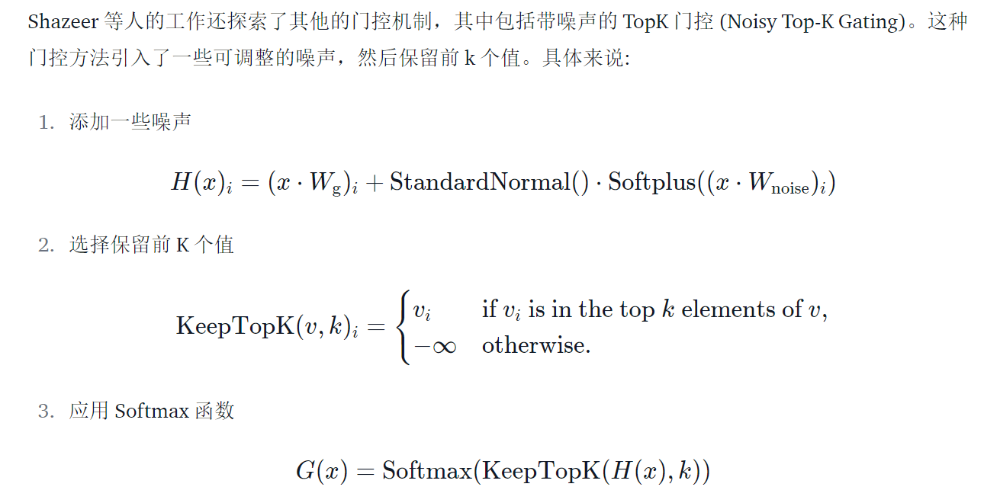

# MOE

混合专家模型 (MoEs):

- 与稠密模型相比， **预训练速度更快**
- 与具有相同参数数量的模型相比，具有更快的 **推理速度**
- 需要 **大量显存**，因为所有专家系统都需要加载到内存中

混合专家模型 (MoE) 的一个显著优势是它们能够在远少于稠密模型所需的计算资源下进行有效的预训练。

混合专家模型主要由两个关键部分组成:

- **稀疏 MoE 层**: 这些层代替了传统 Transformer 模型中的前馈网络 (FFN) 层。MoE 层包含若干“专家”(例如 8 个)，每个专家本身是一个独立的神经网络。在实际应用中，这些专家通常是前馈网络 (FFN)，但它们也可以是更复杂的网络结构，甚至可以是 MoE 层本身，从而形成层级式的 MoE 结构。
- **门控网络或路由**: 这个部分用于决定哪些令牌 (token) 被发送到哪个专家。例如，在下图中，“More”这个令牌可能被发送到第二个专家，而“Parameters”这个令牌被发送到第一个专家。有时，一个令牌甚至可以被发送到多个专家。令牌的路由方式是 MoE 使用中的一个关键点，因为路由器由学习的参数组成，并且与网络的其他部分一同进行预训练。

总结来说，在混合专家模型 (MoE) 中，将传统 Transformer 模型中的每个前馈网络 (FFN) 层替换为 MoE 层，其中 MoE 层由两个核心部分组成: 一个**门控网络**和若干数量的**专家**。

## 稀疏性

稀疏性的概念采用了**条件计算**的思想。

在传统的稠密模型中，所有的参数都会对所有输入数据进行处理。相比之下，稀疏性允许我们仅针对整个系统的某些特定部分执行计算。这意味着并非所有参数都会在处理每个输入时被激活或使用，而是根据输入的特定特征或需求，只有部分参数集合被调用和运行。

**引入稀疏性带来的问题：**

例如，在混合专家模型 (MoE) 中，尽管较大的批量大小通常有利于提高性能，但当数据通过激活的专家时，实际的批量大小可能会减少。

比如，假设我们的输入批量包含 10 个 token， 可能会有五个 token 被路由到同一个专家，而剩下的五个 token 分别被路由到不同的专家。这导致了批量大小的不均匀分配和资源利用效率不高的问题。

一个可学习的门控网络 (G) 决定将输入的哪一部分发送给哪些专家 (E):
$$
y=\sum_{i=1}^nG(x)_iE_i(x)
$$
一个典型的门控函数通常是一个带有 softmax 函数的简单的网络。这个网络将学习将输入发送给哪个专家。
$$
G_\sigma(x)=\mathrm{Softmax}(x\cdot W_g)
$$

## MOE 中的 token 负载均衡

如果所有的令牌都被发送到只有少数几个受欢迎的专家，那么训练效率将会降低。

在通常的混合专家模型 (MoE) 训练中，门控网络往往倾向于主要激活相同的几个专家。这种情况可能会自我加强，因为受欢迎的专家训练得更快，因此它们更容易被选择。为了缓解这个问题，引入了一个 **辅助损失**，旨在鼓励给予所有专家相同的重要性。这个损失确保所有专家接收到大致相等数量的训练样本，从而平衡了专家之间的选择。

## Switch Transformers

Switch Transformers 提出了一个 Switch Transformer 层，它接收两个输入 (两个不同的token) 并拥有四个专家。

与最初使用至少两个专家的想法相反，Switch Transformers 采用了简化的单专家策略。这种方法的效果包括:

- 减少门控网络 (路由) 计算负担
- 每个专家的批量大小至少可以减半
- 降低通信成本
- 保持模型质量

Switch Transformers 也对 **专家容量** 这个概念进行了研究：
$$
\mathrm{Expert~Capacity}=\left(\frac{\text{tokens per batch}}{\text{number of experts}}\right)\times\text{capacity factor}
$$
上述建议的容量是将批次中的令牌数量均匀分配到各个专家。如果使用大于 1 的容量因子，为令牌分配不完全平衡时提供了一个缓冲。增加容量因子会导致更高的设备间通信成本，因此这是一个需要考虑的权衡。特别值得注意的是，Switch Transformers 在低容量因子 (例如 1 至 1.25) 下表现出色。

作者还尝试了混合精度的方法，例如用 `bfloat16` 精度训练专家，同时对其余计算使用全精度进行。较低的精度可以减少处理器间的通信成本、计算成本以及存储张量的内存。然而，在最初的实验中，当专家和门控网络都使用 `bfloat16` 精度训练时，出现了不稳定的训练现象。这种不稳定性特别是由路由计算引起的，因为路由涉及指数函数等操作，这些操作对精度要求较高。因此，为了保持计算的稳定性和精确性，保持更高的精度是重要的。为了减轻不稳定性，路由过程也使用了全精度。

稠密模型和稀疏模型在过拟合的动态表现上存在显著差异。稀疏模型更易于出现过拟合现象，因此在处理这些模型时，尝试更强的内部正则化措施是有益的，比如使用更高比例的 dropout。例如，我们可以为稠密层设定一个较低的 dropout 率，而为稀疏层设置一个更高的 dropout 率，以此来优化模型性能。

## 几种并行模式

并行计算的几种形式:

- **数据并行**: 相同的权重在所有节点上复制，数据在节点之间分割。
- **模型并行**: 模型在节点之间分割，相同的数据在所有节点上复制。
- **模型和数据并行**: 我们可以在节点之间同时分割模型和数据。注意，不同的节点处理不同批次的数据。
- **专家并行**: 专家被放置在不同的节点上。如果与数据并行结合，每个节点拥有不同的专家，数据在所有节点之间分割。

在专家并行中，专家被放置在不同的节点上，每个节点处理不同批次的训练样本。对于非 MoE 层，专家并行的行为与数据并行相同。对于 MoE 层，序列中的令牌被发送到拥有所需专家的节点。

