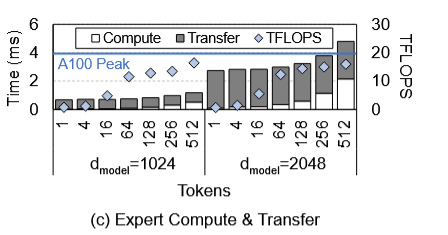
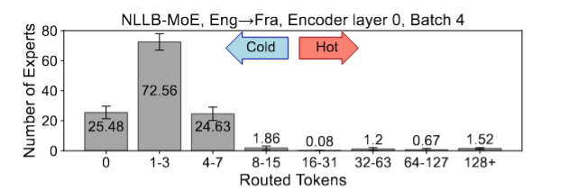
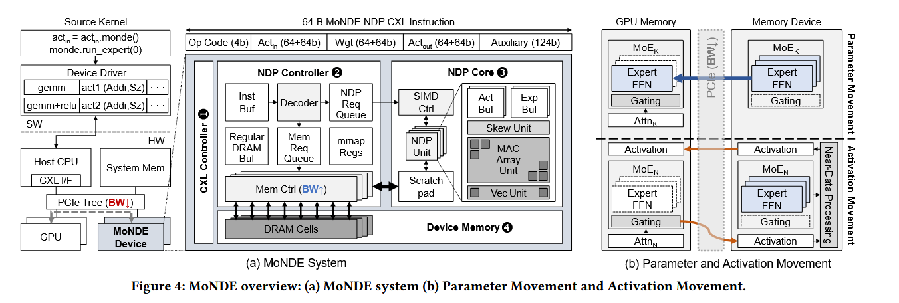
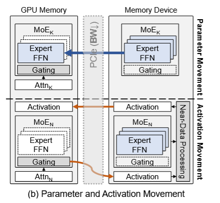
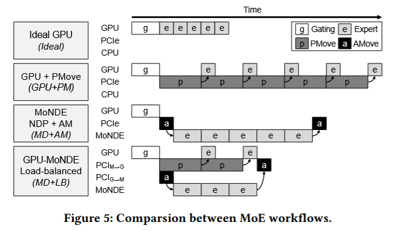
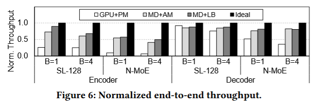
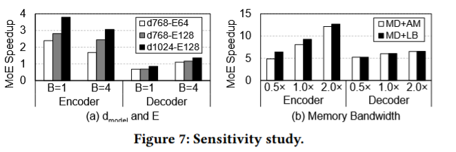
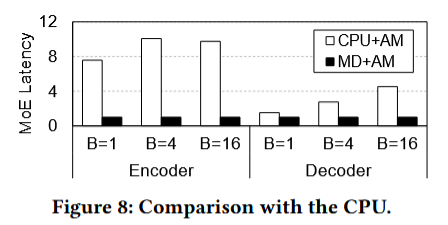
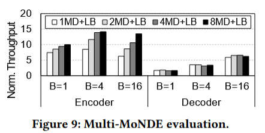

# MoNDE

> MoNDE: Mixture of Near-Data Experts for Large-Scale Sparse Models 2024/05

“Near Data” 策略通过将一部分计算任务”搬到”数据存储位置附近来解决这个问题。

MoNDE将不常用的“冷”专家放置在主内存中，只有需要时才激活传输相关信息，而不是直接移动所有数据到GPU上。这种近数据处理方式可以减少大量不必要的数据移动，从而显著降低延迟，提高模型的推理效率。

## 一、背景

虽然混合专家（MoE）Transformer模型能够显著提升模型容量，而不会按比例增加训练成本，但在推理服务场景下仍然面临挑战。其原因在于，所有专家的参数都需要驻留在GPU中，这对于推理服务来说会带来较高的成本。

微软的 `DeepSpeed` 通过将模型参数从 GPU 显存卸载到 CPU 内存或 SSD，并在计算需要时再将它们重新加载回 GPU，来缓解这种内存容量需求。这种参数卸载技术能够在一定程度上降低 GPU 的显存占用，从而减少对高成本 GPU 显存的依赖。

然而，这种参数卸载方法会导致大量的数据传输开销，因为每次调用专家时，参数需要在CPU 或 SSD 与 GPU 之间频繁传输。这样的数据移动会显著影响推理延迟，增加推理时间。因此，虽然参数卸载在一定程度上节省了 GPU 内存，但它并非理想的推理优化方案，尤其是在对**延迟敏感**的场景下。

论文中指出，在混合专家（MoE）模型中，专家参数的传输延迟很难通过常见的计算隐藏技术（如参数预取）来有效掩盖。原因在于，与非MoE模型不同，MoE模型中的专家参数传输是动态决定的，这一决定过程发生在每个专家的前馈网络（FFN）计算之前，基于输入的激活值和稀疏门控函数（sparse gating functions）。

具体来说，在MoE模型中，稀疏门控函数会根据输入数据的特征动态地选择需要激活的专家。这意味着哪些专家会被选中在每次推理过程中都是不同的，且这一选择只有在接收到输入激活值之后才能确定。因此，**模型无法在计算前预先知道哪些专家的参数会被需要。**

参数预取技术通常在**非MoE模型中有效，因为在这些模型中，计算顺序是固定的，参数需求是可以预测的**。然而在MoE模型中，由于专家选择的动态性，参数预取变得困难。每次都需要在激活特定专家之后再去加载对应的专家参数，从而导致传输延迟无法被有效掩盖，这种动态传输会增加推理延迟并影响整体性能。

> **参数预取技术**（Parameter Prefetching）是一种用于提高计算效率、减少延迟的优化方法。它的核心思想是在计算过程中提前将需要的模型参数从存储位置（如CPU内存或硬盘）加载到计算单元（如GPU内存）中，以确保计算需要时这些参数已经在快速访问的内存中，从而减少因等待数据传输而产生的延迟。

**传输瓶颈的影响**：然而，论文指出，简单地将卸载的专家参数从CPU传回GPU，会在MoE推理过程中造成**严重的性能瓶颈**。在图2(c)中，论文展示了专家参数传输和专家计算所需的时间，将其分解为“专家计算时间”和“参数传输时间”两个部分。结果显示，当专家接收到的tokens数量较少时，将单个专家参数传输到GPU所需的时间远远超过实际的专家计算时间。例如，当只路由了一个token时，参数传输时间可能是专家计算时间的30倍以上。

### **专家负载不均衡**

- **稀疏门控的影响**：MoE模型使用稀疏门控网络来决定每个token被路由到哪个专家。由于稀疏门控的特性，不同专家接收的tokens数量差异显著，这导致了专家之间的负载不平衡。
- **专家负载的不均衡分布**：在图3中，论文展示了tokens在专家之间的分布不均衡。x轴表示每个专家接收到的tokens数量，y轴表示拥有该tokens数量范围的专家数量。可以看到，只有少数“热门”专家处理了大量tokens，而大多数“冷门”专家仅处理极少量的tokens（例如0到7个tokens）。
- **计算与内存的失衡**：由于这种负载不均衡，MoE模型的专家计算强度（即计算与内存的比率）也因专家的不同而异。对于大多数专家来说，它们的计算主要是**受内存限制的**，即内存传输速度成为瓶颈，导致GPU核心利用率较低，资源未得到充分利用。

## 二、Activation Movement

### 1. **激活移动 vs. 参数移动**

- **参数移动的高成本**：传统的混合专家（MoE）模型需要在推理时将专家参数从主存储（如CPU内存或SSD）传输到GPU，以进行专家计算。然而，这种频繁的参数传输会带来显著的延迟和带宽开销。
- **激活移动的优势**：MoNDE 提出了一种新的数据移动范式，称为**激活移动**。在这种方法中，MoNDE 不再传输专家参数，而是将GPU生成的**激活值（activations）**传输到包含 MoNDE 近数据处理（NDP）单元的主存储设备。MoNDE 的 NDP 单元接收这些激活值，并在靠近存储的地方完成专家的计算。这种方法相比直接传输参数，更为廉价且高效。

### 2. **MoNDE NDP 单元的计算流程**

- 当激活值（即来自注意力层的输出）从GPU传输到MoNDE的NDP单元后，NDP单元在存储附近完成专家计算。
- 完成专家计算后，MoNDE将得到的**输出激活值**传回GPU，以供后续的Transformer操作（例如后续的注意力层计算）使用。
- 通过这种方式，MoNDE有效地减少了昂贵的参数传输需求，仅需传输较小的激活值数据，大大降低了推理延迟。

### 3. **GPU-MoNDE负载均衡方案**

- 论文还提出了一种**GPU-MoNDE负载均衡方案**，进一步优化了MoE的推理效率。由于MoE模型的专家使用通常存在**不均衡性（偏斜性）**，即某些专家会被频繁调用，而其他专家则较少调用。
- 为此，MoNDE的负载均衡方案使得GPU和MoNDE的NDP单元可以**并行**运行专家计算。GPU可以处理高频调用的专家，而低频的专家计算则交由MoNDE的NDP单元处理，从而进一步减少推理延迟。

## 三、MoNDE架构

通过**专用硬件**和**负载均衡策略**优化MoE模型推理性能的动机及其具体设计。主要涉及以下几个方面：

### 1. **专用硬件的优势**

- **低峰值计算性能的专用硬件**：第2.2节讨论表明，虽然专用硬件的峰值计算性能低于GPU，但其仍可以在执行专家计算时提供与GPU相似的性能。这是因为MoE模型在进行推理时，由于专家选择的动态性和负载不均衡，GPU资源往往无法被充分利用，因此可以通过专用硬件优化这一过程。
- **避免参数传输的影响**：如果可以避免频繁的专家参数传输，那么MoE的整体执行时间甚至可能优于使用GPU进行专家计算。这是因为，避免参数移动不仅能降低数据传输的延迟，还能提高模型的整体执行效率。这一观察为论文提出的优化策略提供了动机。

### 2. **设计专用的NDP硬件**

- **NDP硬件的设计**：为了有效处理冷门专家的计算，论文设计了一个专用的近数据处理（NDP）硬件。NDP硬件的设计专门用于执行**大且宽的矩阵乘法**，这正是冷门专家通常需要处理的计算任务。
- **激活移动（AMove）策略**：论文提出的AMove策略旨在替代传统的参数传输。通过将激活值从GPU传输到NDP硬件上进行计算，而非传输整个专家参数，可以大幅减少传输延迟。AMove策略与NDP硬件的结合，使冷门专家的计算可以在主存储设备中高效完成，减少了对GPU内存的依赖和传输瓶颈。

### 3. **专家负载均衡**

- **热/冷专家的负载分配**：论文提出，通过将热专家和冷专家分配到适合其工作负载的硬件上，可以进一步优化MoE的推理效率。热专家，即频繁被调用的专家，由于其计算需求较高，因此适合继续在GPU上进行计算。
- **冷专家的卸载**：冷专家的计算量较小、调用频率较低，因此可以在NDP硬件上完成，以避免GPU资源的浪费并减少传输延迟。

**MoNDE 系统架构**

sw（软件层）：Source Kernel 负责发起调用，Device Driver 执行底层的矩阵和激活操作。负责协调、调度和管理MoNDE系统的操作，将高层的计算请求（如矩阵运算和激活函数调用）转化为具体的硬件指令。

hw（硬件层）：MoNDE的硬件部分，包括实际进行计算的NDP（近数据处理）单元。

**MoNDE设备架构**

- **CXL Controller**：负责与主机系统的交互，通过**Compute Express Link (CXL)**协议进行数据传输。CXL是一种高带宽、低延迟的接口，支持设备内存与主机之间的数据交换。

- **NDP Controller**：NDP控制器负责管理指令缓存（Inst Buf）、解码器（Decoder）、请求队列（Mem Req Queue）等模块。它将从主机接收的指令解码，并将计算任务发送到 NDP 核心。
- **NDP Core**：NDP核心包含SIMD控制器（用于控制并行运算）、缓冲区（用于存储激活值和专家参数）、MAC阵列单元（进行矩阵乘法）和矢量单元（Vec Unit）等。
- **设备内存（Device Memory）**：设备内存包含DRAM单元，用于存储专家计算过程中需要的中间数据。

## 四、PMove 与 AMove

### 1. MoE模型中的两类参数

在MoE Transformer模型中，参数分为两类：

- **密集参数（dense parameters）**：这些参数不依赖输入条件，被无条件地使用。它们在推理过程中始终参与计算，通常可以直接保存在GPU内存中。
- **专家参数（expert parameters）**：这些参数是稀疏的，仅在“门控函数（gating function）”根据输入动态激活对应的专家时才被使用。专家参数的数量通常非常庞大，无法完全装入单个GPU的内存中，因此需要一种灵活的处理方式。

### 2. 参数移动（PMove）策略

在现有的大型语言模型卸载框架中（如DeepSpeed等），专家参数的处理方式通常是**参数移动（PMove）**。PMove的工作方式是：

- 当需要某个专家进行计算时，从CPU或主机内存中将该专家的参数传输到GPU。
- 一旦加载新专家的参数，就需要驱逐掉GPU上当前存在的其他专家参数，以腾出空间。

这种参数移动策略的主要问题在于：

- **频繁的数据移动**：由于专家参数在推理过程中不断地被动态激活和驱逐，PMove需要频繁地在CPU和GPU之间传输大块数据，导致大量的数据传输开销。
- **延迟增加**：这种频繁的参数传输大大增加了推理延迟，因为GPU需要等待专家参数加载完毕才能执行计算。

### 3. 激活移动（AMove）策略

为了解决PMove策略中的数据传输瓶颈，MoNDE提出了一种新的方法，即**激活移动（Activation Movement，AMove）**。AMove的主要思路是：

- 将所有的专家参数保存在MoNDE的近数据处理（NDP）内存设备中，而不是频繁地加载到GPU中。
- **操作流程**：在执行专家计算时，将输入激活（input activations）从GPU传输到MoNDE内存设备中的NDP核心。NDP核心利用本地存储的专家参数进行计算，完成后将输出激活（output activations）传回GPU。

AMove的优势在于：

- **减少数据传输量**：与PMove需要传输整个专家参数不同，AMove仅需传输小量的输入和输出激活，数据量显著减少。
- **降低延迟**：因为传输的是较小的激活数据，而非大规模的参数数据，推理过程中的延迟大幅降低。

### 4. AMove 和 PMove 的复杂度对比

论文中的图4(b)展示了AMove和PMove的对比。通过激活移动策略，MoNDE系统能够将专家参数“固定”在NDP内存设备中，仅需进行激活数据的传输，避免了PMove中的大量参数移动开销，从而更有效地支持大规模稀疏模型的推理任务。

### 1. 参数移动（PMove）的复杂度

参数移动策略（PMove）需要频繁地将大量的专家参数从内存设备传输到GPU，因此其数据移动量随着模型的规模迅速增加。

- **复杂度公式**：PMove的数据移动量可以表示为
  $$
  \text{Parameter Movement} = 2 \times E \times d_{\text{model}} \times d_{ff}
  $$
  其中：

  - $E$ 是专家的数量。
  - $d_{\text{model}}$ 是模型的嵌入维度。
  - $d_{ff}$ 是前馈网络的内部维度。

- **扩展性问题**：由于PMove的复杂度呈立方级增长，随着 $d_{\text{model}}$、$d_{ff}$和 $E$ 的增大，数据移动量也呈现出立方级的上升。这种指数增长在带宽有限的情况下会导致严重的传输延迟，特别是在需要通过PCIe等接口传输大规模数据时，带来了显著的性能瓶颈。

### 2. 激活移动（AMove）的复杂度

激活移动策略（AMove）仅需在NDP设备和GPU之间传输激活数据，而非整个专家参数，因此数据传输量大大减少。

- **复杂度公式**：AMove的数据移动量可以表示为：
  $$
  \text{Activation Movement} = 2 \times B \times S \times d_{\text{model}}
  $$
  其中：

  - $B$ 表示每批次的序列数（batch size）。
  - $S$ 表示每个序列中的token数量。
  - $d_{\text{model}}$ 是模型的嵌入维度。

- **扩展性优势**：在许多MoE推理任务中，$B$ 和 $S$ 的值较小。因此，AMove的数据移动复杂度可以简化为 $O(d_{\text{model}})$，即数据量仅随嵌入维度线性增长。这大大降低了数据传输需求，与PMove相比，AMove在需要更高专家数量或更大嵌入维度的情况下更加高效。

## 五、GPU-MoNDE 负载均衡

将计算密集的专家分配给GPU，而其他专家则交由MoNDE的近数据处理（NDP）单元来处理。

### 1. GPU-MoNDE负载均衡的原理

MoE模型中不同专家的负载是**不均衡的**，这意味着部分专家处理的数据量（计算强度）比其他专家更多（称为“热专家”或“hot experts”）。论文提出的负载均衡策略是：

- 将计算密集的热专家分配给GPU处理。
- 将剩余的专家分配给MoNDE的NDP单元处理。

这样做的目的是让两个硬件并行执行不同专家的计算，从而优化整体推理速度。通过负载均衡，每个硬件都能得到合适的工作负载，实现资源的高效利用。

### 2. 确定参数 $H$

在该策略中，参数 $H$ 是一个关键值，表示分配给GPU的热专家数量。论文指出，**如何选择$H$** 会显著影响性能：

- 如果将过多专家分配给GPU，可能会导致过多的数据移动，增加延迟。
- 如果分配得过少，则可能导致GPU资源未被充分利用，影响效率。

因此，目标是找到一个合适的 $H$ 值，使得GPU和MoNDE工作流的执行时间平衡，从而最小化总执行时间。

### 3. 执行时间的近似计算

论文定义了GPU和MoNDE的执行时间，并提出了两个近似计算的公式来确定 $H$：

- 执行时间公式：

  - GPU的执行时间为 $t_{GW F} = t_{PM} + t_{GPU}$。
  - MoNDE的执行时间为 $t_{MDW F} = t_{AM} + t_{MD}$。
  - 这里，$t_{PM}$ 是PMove策略的参数传输延迟，$t_{GPU}$ 是 GPU 的计算延迟，$t_{AM}$ 是AMove 策略的激活传输延迟，而 $t_{MD}$ 是 MoNDE 设备的计算延迟。

- 近似传输延迟：考虑到带宽限制，传输延迟的近似计算如下：

  $t_{PM} \approx \frac{\text{Expert}_{GPU}}{\text{BW}_{PCIe}}$

  $t_{MD} \approx \frac{\text{Expert}_{MD}}{\text{BW}_{MD}}$

  其中：

  - $\text{Expert}_{GPU}$ 和 $\text{Expert}_{MD}$ 分别代表在 GPU 和 MoNDE 上处理的专家数量。
  - $\text{BW}_{PCIe}$ 和 $\text{BW}_{MD}$ 分别表示 PCIe 带宽和 MoNDE 设备的带宽。

### 4. 计算 $H$ 值的公式

论文通过将上述公式结合，得到 $H$ 的计算公式：

$H = \alpha \times \text{Expert}_{GPU} = \alpha \times \frac{\text{BW}_{PCIe}}{\text{BW}_{MD} + \text{BW}_{PCIe}} \times \text{Expert}_{\text{Activ}}$

其中：

- $\alpha$ 是一个缩放因子，用于微调 $H$ 值，适应不同负载的计算强度。
- $\text{Expert}_{\text{Activ}}$ 是被激活的专家总数。

### 5. 自动调整和优化 HHH 值

为了找到最佳的 $H$ 值，MoNDE框架实现了一种自动调优的机制，即通过分析过去小批量输入的数据，找出最佳的 $H$ 值（例如 $H + 1$ 或 $H + 2$）。这种自动调优的过程能够不断调整 $H$ 值，确保在不同负载条件下实现最优性能。

### 6. 多MoNDE设备场景

在多MoNDE设备的情况下，MoNDE算法根据设备的总带宽来确定 $H$ 值，并采用轮转方式将专家的工作负载分配到不同的MoNDE设备上。每个设备单独处理分配到的输入数据，最终再将输出激活传回GPU进行合并。

## 六、实验结果

论文的实验结果显示了MD+LB和MD+AM策略在不同模型上的加速效果：

- Switch-Large (SL-128) 模型：
  - 编码器的吞吐量相比GPU+PM策略提高了**3.1倍**。
  - 解码器的吞吐量提高了**1.1倍**。
- NLLB-MoE (N-MoE) 模型：
  - 编码器的吞吐量相比GPU+PM策略提高了**6.7倍**。
  - 解码器的吞吐量提高了**1.9倍**。

MoNDE在不同模型规模和带宽条件下的**敏感性**表现，重点探讨了MD+LB（负载均衡）策略在模型规模和内存带宽变化时的加速效果。

### 1. 图7(a) - 模型规模对加速效果的影响

图7(a)展示了在不同配置的Switch Transformers模型中，MD+LB相对于GPU+PM的加速效果。模型的配置变化主要体现在嵌入维度（$d_{\text{model}}$）和专家数量（$E$）的变化。分析结果表明：

- **随着模型规模的增大**，MD+LB的加速效果越显著。较大的模型意味着更高的计算和内存需求，MoNDE的负载均衡策略在处理较大规模的嵌入维度和更多的专家时表现出了更强的适应性。
- **鲁棒性**：MD+LB策略在不同的 $d_{\text{model}}$ 和 $E$ 配置下均能保持良好的加速效果，说明该策略具有较好的扩展性和鲁棒性，能够适应更大规模的MoE模型。

### 2. 图7(b) - 内存带宽对加速效果的影响

图7(b)展示了NLLB-MoE模型（批量大小为4）的加速效果，比较了在不同内存带宽和NDP计算速率下，MD+AM和MD+LB相对于GPU+PM的加速表现。分析结果如下：

- **带宽与冷专家延迟**：在MoE模型中，大部分专家被称为“冷专家”，即仅处理少量token。更高的内存带宽能够显著减少这些冷专家的传输延迟，从而提高了整体的加速效果。
- **MD+LB优于MD+AM**：在带宽提高的情况下，MD+LB通过动态控制参数 $H$ 值来平衡GPU和MoNDE NDP的计算负载，使其在更高带宽下仍然优于MD+AM。
- **带宽对 $H$ 值的影响**：带宽增加时，MD+LB会选择较小的 $H$ 值，以保持更保守的负载均衡分配，这意味着更多专家计算任务将交给NDP而非GPU。这解释了带宽提升后，MD+LB和MD+AM之间的加速差距有所缩小。

### 1. CPU和MoNDE的延迟对比

论文对比了使用CPU和MoNDE进行专家计算时的延迟表现，具体包括：

- **CPU+AM**：在CPU上执行激活移动（AMove）策略的专家计算。
- **MD+LB**：MoNDE使用负载均衡（MD+LB）策略进行专家计算。

实验结果表明：

- **MD+AM**在编码器和解码器的延迟上分别减少了**9.1倍**和**1.9倍**，相比CPU具有显著优势。
- 这种延迟减少主要是因为**MoNDE内存带宽**更高（比CPU带宽高出2.7倍），使得数据传输更快。

### 2. CPU性能的局限性

论文进一步分析了即使CPU带宽更高，CPU在专家计算中的局限性：

- **远程NUMA访问**：CPU通常依赖多节点内存架构（NUMA），这意味着数据需要在多个物理内存区域之间进行远程访问。远程NUMA访问会增加内存延迟，导致CPU在大规模专家计算任务中的性能降低。
- **不可扩展性**：CPU在处理大规模专家计算任务时难以扩展，因为其内存和计算资源受限。即便增加带宽，CPU的结构性限制使其在实际应用中难以充分发挥更高带宽的优势。

### 3. MoNDE的可扩展性优势

与CPU不同，MoNDE具有显著的可扩展性：

- **通过PCIe扩展更多设备**：MoNDE系统可以通过PCIe插槽添加更多的MoNDE设备，从而增加计算和内存带宽，进一步提高吞吐量。
- **提高并行处理能力**：MoNDE能够更高效地并行处理多个专家计算任务，适用于大规模的稀疏模型推理需求。

### MoNDE系统的可扩展性

### 1. 实验设置

图9中的实验将多MoNDE设备的吞吐量与**GPU+PM**策略下的吞吐量进行归一化对比，主要目的是展示MoNDE设备数量增加时对推理吞吐量的影响。分析分为**编码器**和**解码器**两部分。

### 2. 编码器的可扩展性表现

- **性能提升**：随着MoNDE设备数量的增加，编码器的推理吞吐量显著提高。MoNDE的扩展性能主要归因于计算能力和内存带宽的同步增加。
- **原因**：在编码器的计算中，较多的专家被激活，且输入token数量较多，因此可以充分利用多个MoNDE设备的计算和带宽资源。
- **总结**：在增加MoNDE设备数量的情况下，编码器的性能几乎呈现线性增长，表明MoNDE在编码器任务上具有很好的可扩展性。

### 3. 解码器的可扩展性表现

- **性能增益有限**：与编码器不同，解码器在增加MoNDE设备数量时的性能提升较小。在不同批次大小（如1、4、16）的情况下，解码器的吞吐量增益与MoNDE设备数量的增加不成正比。
- **原因**：解码器中通常仅有少量输入token被处理（例如1、4或16个token），这些小批量数据不足以完全利用多个MoNDE NDP单元的计算能力。因此，即使增加MoNDE设备，解码器的实际性能提升有限。
- **总结**：解码器的性能增益与批次大小和输入token数密切相关，只有在输入数据量较大时才能充分利用多MoNDE设备的优势。

### **MoNDE系统与多GPU系统**在处理MoE模型推理时的性能表现

### 1. 多GPU系统的工作原理和限制

在多GPU配置中，MoE模型的**专家并行性**使得专家参数可以分布到多个GPU上，这样可以充分利用每个GPU的内存容量。这种配置有助于处理大型模型，因为可以将专家参数分散到多张GPU上以适应单个GPU的内存限制。然而，多GPU系统在以下方面存在不足：

- **解码器的低效性**：MoE模型的解码器部分是**自回归的（auto-regressive）**，即每个输入token通常仅激活一到两个专家。因此，在多GPU环境下，大部分GPU可能处于空闲状态，资源未被充分利用，导致解码器在多GPU系统中的推理效率较低。
- **资源浪费**：由于不是所有GPU上的专家都会被激活，因此会出现GPU资源浪费的情况，特别是在处理稀疏专家的自回归任务时。

### 2. MoNDE系统与多GPU系统的吞吐量对比

论文在图10中比较了**MD+LB（MoNDE负载均衡策略）\**和\**2-GPU系统**在NLLB-MoE模型的编码器和解码器任务上的吞吐量：

- **编码器任务**：多GPU系统在编码器任务中显示出更高的吞吐量。原因在于编码器激活的专家数量较多，因此能够在多GPU上并行处理更多专家计算，充分利用GPU的计算能力。
- **解码器任务**：MoNDE系统在解码器任务中的吞吐量与多GPU系统相当。由于解码器只激活少量专家，因此在多GPU系统中大量GPU资源未被使用，而MoNDE则通过负载均衡灵活地利用其NDP单元，实现了与多GPU系统相似的性能。

### 3. MoNDE系统的成本效益优势

MoNDE系统具有较高的**成本效益**，特别是在生成型大型语言模型（LLMs）的推理任务中，MoNDE展现了以下优势：

- **单个MoNDE设备的内存容量**可以与多张现代GPU相媲美，因此在相同内存需求下，MoNDE可以使用更少的硬件来实现与多GPU系统相近的性能。
- **更高的性价比**：相较于需要多张GPU来存储和计算专家参数的多GPU系统，MoNDE在硬件成本上更加经济，同时在解码器任务上能够有效利用NDP单元减少资源浪费。