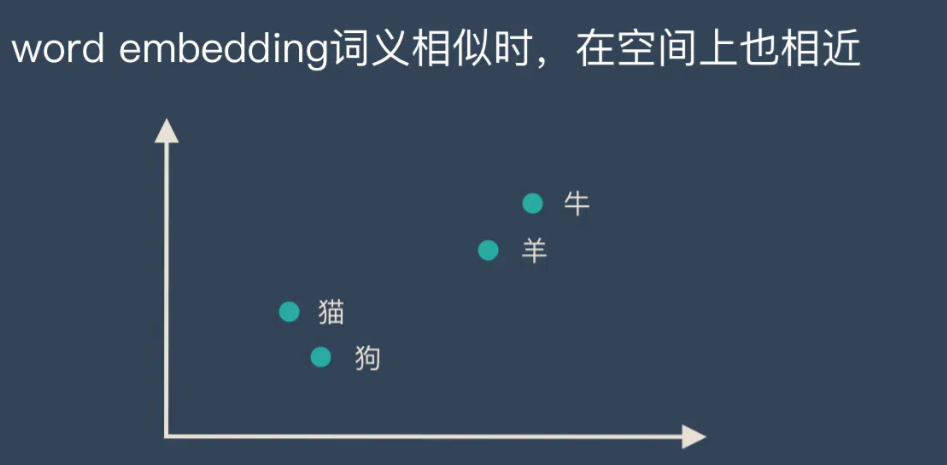
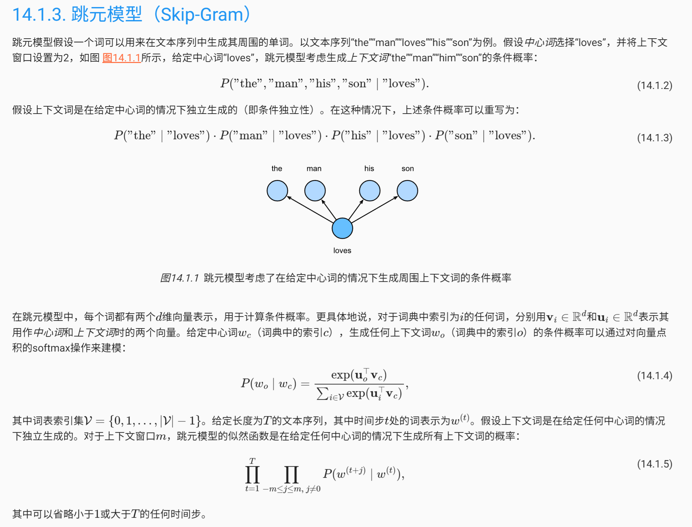
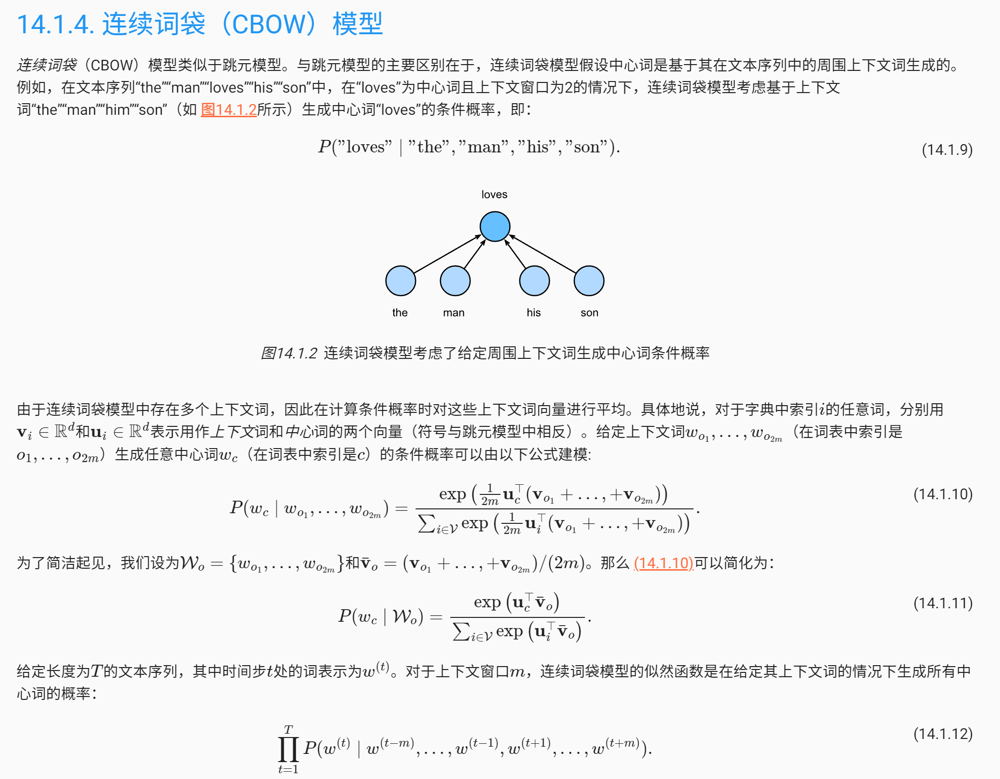
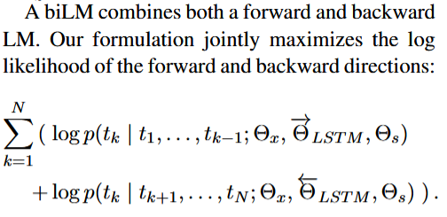

# Word Embedding

## 文本表示（Representation）:

文本是一种非结构化的数据信息，是不可以直接被计算的。

**文本表示的作用就是将这些非结构化的信息转化为结构化的信息**，这样就可以针对文本信息做计算，来完成我们日常所能见到的文本分类，情感判断等任务。


文本表示的方法有很多种：

1. 独热编码：无法表达词语之间的关系；这种过于稀疏的向量，导致计算和存储的效率都不高

2. word-embedding：可以将文本通过一个低维向量来表达，不像 one-hot 那么长。语意相似的词在向量空间上也会比较相近。



## 2 种主流的 word embedding 算法

### (1) word2vec

2013

 word2vec 算法通过对大型语料库中的文本进行建模来估计这些表示。经过训练，这样的模型可以检测同义词或为部分句子建议附加单词。 Word2vec 由Tomáš Mikolov和Google的同事开发，于 2013 年发布。

Word2vec 将单词表示为高维数字向量，用于捕获单词之间的关系。特别是，出现在相似上下文中的单词被映射到通过**余弦相似度**(consing similarity)测量的附近的向量。这表明单词之间的**语义相似程度**(semantic similarity)，例如， “walk”和”ran”的向量很接近，“but”和“however”以及“Berlin”和“Germany”的向量也很接近。

Word2vec 将大型[文本语料库](https://en.wikipedia.org/wiki/Text_corpus)作为输入，并生成一个[向量空间](https://en.wikipedia.org/wiki/Vector_space)，通常有数百[维](https://en.wikipedia.org/wiki/Dimensions)，[语料库](https://en.wikipedia.org/wiki/Corpus_linguistics)中的每个唯一单词都在该空间中分配一个相应的向量。

#### 1）跳元模型（Skip-Gram）



#### 2）连续词袋（CBOW）模型



***

### (2) Glove

2014


***

## ELMo

ELMo（Embeddings from Language Models） 2018/3

### **静态词向量**
Word2Vec 和 GloVe 生成的词嵌入是静态的，这意味着每个单词在所有上下文中都具有相同的向量表示。无论该单词在不同语境下的含义如何变化，嵌入向量都不变。因此，它们无法捕捉同一个词在不同语境中的多义性。例如，“bank” 在“river bank”和“financial bank”中会有不同的含义，但静态嵌入方法无法区分。

它可以根据整个句子的上下文生成词的深度上下文化表示。与传统词嵌入不同，ELMo通过双向LSTM（biLSTM）架构捕捉词义在不同上下文中的动态变化。

### **与以往方法的不同**：

- 以往的方法（如 Peters et al., 2017 和 McCann et al., 2017）虽然也学习了上下文化的词向量，但通常只使用模型的部分输出层或某一层的输出向量。换句话说，它们并未充分利用整个模型的所有层次信息。
- ELMo 不同之处在于它是**深层的**（"deep"）。这里的“深层”是指 ELMo 的词向量不仅依赖于模型的输出层，还利用了**双向语言模型（biLM）内部所有层的输出**。

### **具体机制**：

- 对于每个词，ELMo 不仅仅使用 LSTM 的顶层输出，而是使用**多层 LSTM 中每一层的表示**。
- ELMo 为每个词计算来自不同层次的向量，然后根据任务需求，**学习一个线性组合**，将这些层次的向量组合成一个最终的表示。这个组合不仅考虑到各个层次的语义和句法信息，还能动态调整不同层的重要性。

通过结合LSTM不同层次的内部状态，ELMo 生成了非常丰富的词表示。每一层的LSTM捕捉的信息不同，这种组合使得词向量能够同时包含多层次的信息，从而增强了对词义和句法的表达能力。

在实验评估中，作者发现**LSTM的高层状态能够捕捉词义随上下文变化的特征**。这意味着高层LSTM特别擅长处理语境相关的语义信息，例如，在词义消歧任务中，不需要对这些高层表示做额外的修改，它们就能直接用于任务，并表现出优异的性能。例如，针对多义词，高层LSTM可以根据上下文动态调整词义，这使其在监督的词义消歧任务中表现突出。

**LSTM的低层状态主要捕捉词汇的句法信息**。例如，低层LSTM能够很好地建模词的形态、词性和句法结构等，因此这些低层向量非常适合用于像词性标注这样的任务，专注于句法信息。

**前向语言模型的基本原理**：

给定一系列的词（tokens），例如 $t_1, t_2, ..., t_N$，前向语言模型通过依赖之前所有的词（历史）来计算当前词 $t_k$ 的概率，即模型通过词的上下文来估计下一个词出现的概率。

数学公式表示就是，整个句子的概率 $p(t_1, t_2, ..., t_N)$ 是通过每个词 $t_k$ 基于之前所有词 $t_1, ..., t_{k-1}$ 的条件概率 $p(t_k | t_1, ..., t_{k-1})$ 的连乘计算得到的。

**ELMo之前的SOTA是怎么做的：**

1. 首先为每个词计算一个**上下文无关**的词表示 $x^{LM}_k$（通过词嵌入或基于字符的CNN计算得到），然后将这个词表示传递给前向LSTM的多层结构进行处理。

2. 每一层LSTM根据当前词的上下文生成一个**上下文相关**的表示 $\overrightarrow{h^{LM}_{k,j}}$，其中$j$表示LSTM的层数。
3. 前向LSTM的最后一层输出（顶层） $\overrightarrow{h^{LM}_{k,L}}$ 被用来预测下一个词 $t_{k+1}$，通过Softmax层来计算该词的概率。

后向语言模型与前向语言模型类似，但它是从句子的反方向进行处理，即根据未来的词 $t_{k+1}, t_{k+2}, ..., t_N$ 来预测当前词 $t_k$ 的概率。

biLM 同时结合了前向和后向语言模型。通过结合这两种模型，biLM 可以同时利用词的前后文信息，生成更为准确的词表示。

模型的目标是**同时最大化前向和后向语言模型的对数似然函数**，也就是说模型会同时考虑前向和后向语言模型的损失来进行训练。



对于每个词 $t_k$，一个包含 L 层的双向语言模型（biLM）会为该词生成一组表示，包含 $2L + 1$个不同的向量。这里的 $2L + 1$ 来自双向LSTM的 $L$ 层输出以及初始的词嵌入表示。
$$
R_k = \{x^{LM}_k, \overrightarrow{h^{LM}_{k,j}}, \overleftarrow{h^{LM}_{k,j}} | j = 1, . . . , L\} = \{h^{LM}_{k,j} | j = 0, . . . , L\}
$$


- $R_k$ 表示词 $t_k$ 的所有层的表示集合。其中，$x^{LM}_k$ 是该词的初始词嵌入（token embedding），$\overrightarrow{h^{LM}_{k,j}}$ 和 $\overleftarrow{h^{LM}_{k,j}}$分别表示第 $j$ 层前向和后向LSTM的输出。合起来，$h^{LM}_{k,j}$ 表示前向和后向 LSTM 的拼接结果。

为了将这些表示用于下游任务，ELMo 会将所有层的表示 $R_k$ 折叠（collapse）为一个单一的向量 $ELMo_k$。这意味着 ELMo 将通过某种方式将多层的表示组合成一个统一的词表示，供下游模型使用。

在最简单的情况下，ELMo 只使用 LSTM 的顶层输出作为词表示（即直接选择最后一层的向量 $h^{LM}_{k,L}$），这是之前方法（如 TagLM 和 CoVe）所采用的方式。更常见的是，ELMo 不仅仅使用顶层的输出，而是**对 biLM 的所有层进行加权组合**，以生成任务特定的词表示。换句话说，ELMo 会根据每个具体任务的需求，动态调整各层输出的重要性。
$$
ELMo^{task}_k = E(R_k; \Theta^{task}) = \gamma_{task} \sum_{j=0}^{L} s_{j}^{task} h^{LM}_{k,j}
$$
对于每个任务，ELMo 会为不同层 $h^{LM}_{k,j}$ 分配权重 $s^{task}_j$，并将这些权重经过 softmax 归一化。最后，通过乘上一个标量参数 $\gamma_{task}$，对整个 ELMo 向量进行缩放，以便适应不同任务。


***

## Bert中的WordPiece

**WordPiece** 是一种**子词级别的分词算法**，最早由 Google 在其机器翻译模型中提出，后来被用于 BERT 等模型中，用来解决自然语言处理中的词汇稀疏性问题。与传统的按词分割（word-level tokenization）不同，WordPiece 将词分解为更小的子词单元，能够更有效地处理低频词、稀有词以及新词汇。

**WordPiece** 是 Google 开发的用于预训练 BERT 的标记化算法。此后，它已在相当多基于 BERT 的 Transformer 模型中得到重用，例如 DistilBERT、MobileBERT、Funnel Transformers 和 MPNET。它在训练方面与 BPE 非常相似，但实际的标记化却有所不同。

### 1. 为什么需要 WordPiece？

在自然语言处理任务中，词汇表通常很大，而有些词非常罕见甚至从未出现在训练数据中，这会导致所谓的“词汇外”（Out-Of-Vocabulary，OOV）问题。为了解决这个问题，WordPiece 通过将罕见词分割成子词单元，使模型即使在遇到未见过的词时也能通过已见过的子词来理解它。

例如，WordPiece 会将“**unhappiness**”这样的词分解为更常见的子词“**un**”、“**happiness**”，其中“**happiness**”还可以进一步分解为“**happy**”和“**ness**”。

### 2. WordPiece原理

WordPiece的一种主要的实现方式叫做BPE（Byte-Pair Encoding）双字节编码。

BPE的过程可以理解为把一个单词再拆分，使得我们的此表会变得精简，并且寓意更加清晰。

比如"loved","loving","loves"这三个单词。其实本身的语义都是“爱”的意思，但是如果我们以单词为单位，那它们就算不一样的词，在英语中不同后缀的词非常的多，就会使得词表变的很大，训练速度变慢，训练的效果也不是太好。

BPE算法通过训练，能够把上面的3个单词拆分成"lov","ed","ing","es"几部分，这样可以把词的本身的意思和时态分开，有效的减少了词表的数量。

WordPiece 的分词过程是基于词频和贪婪算法的。以下是其核心工作原理：

- **初始化词汇表**：首先，词汇表只包含所有的单个字符，即词汇表中的基础单位是字母或字符。

- **合并高频子词对**：在初始词汇表的基础上，算法逐步合并在文本中高频出现的子词对（字符对或已有子词对）。具体来说，每次合并最频繁的子词对，将其添加到词汇表中，直到词汇表的大小达到预定限制。

  例如，如果“**un**”和“**happy**”在文本中频繁出现，WordPiece 可能会首先将它们合并为“**unhappy**”，再进一步处理其他高频子词。

- **贪婪选择**：当模型遇到一个词时，会尽可能选择最长的匹配子词进行分割。例如，模型会将“**unhappiness**”分割为“**un** + **happiness**”，而不是单独的字母或更短的子词。

### 3. **WordPiece 分词示例**：

假设有以下句子：

```
The dogs are running happily.
```

如果词汇表中没有“running”和“happily”这两个词，WordPiece 可能会将它们分解为更小的子词：

- **running** → “run” + “##ning” （“##”表示这是一个子词片段）
- **happily** → “happy” + “##ly”

这种分词方式确保了子词之间的关系保持完整，即使是模型未见过的新词或低频词，也可以通过子词拼接来理解。

### 4. **与BPE算法的对比**：

**WordPiece** 和 **BPE（Byte Pair Encoding）** 都是子词级别的分词算法，它们的目标都是将词分解为更小的子词单元来表示，以解决词汇稀疏性和词汇外（OOV）问题。

**BPE（Byte Pair Encoding）**：

- BPE 是基于**字符对的频率**来构建词汇表的算法。
- 它从最初的单个字符开始，每次找到频率最高的字符对，并将这些字符对合并为一个新的符号，然后继续合并直到词汇表达到预定大小。
- BPE 的基本思想是贪婪算法，它通过最大化高频字符对的合并，逐渐生成子词单元，避免直接处理每个完整的单词。

**WordPiece**：

- WordPiece 也是基于子词单元的分词方法，但它的核心区别在于它使用的是基于**概率最大化**而不是字符对频率的策略。
- WordPiece 在生成子词单元时，不仅考虑频率，还考虑通过合并某个子词对提升语言模型训练的对数似然值。每次它选择最能提升语言模型的子词对进行合并，而不是简单地基于频率。

总结：

- **BPE** 更注重频次统计，合并策略简单高效，但对语义一致性考虑不足，可能导致次优分词。
- **WordPiece** 则通过最大化概率和语言模型训练效果进行分词，词汇表质量更高，特别适合需要上下文感知的复杂自然语言处理任务。


### 5. **WordPiece 的优点**：

- **减少 OOV 问题**：通过子词单元的分割，WordPiece 极大减少了未见过的词汇问题，因为即使是罕见词也可以分解为常见的子词。
- **高效处理低频词**：WordPiece 能够将低频词和新词合理分割成已知的子词，因此在实际应用中表现出色。

***


